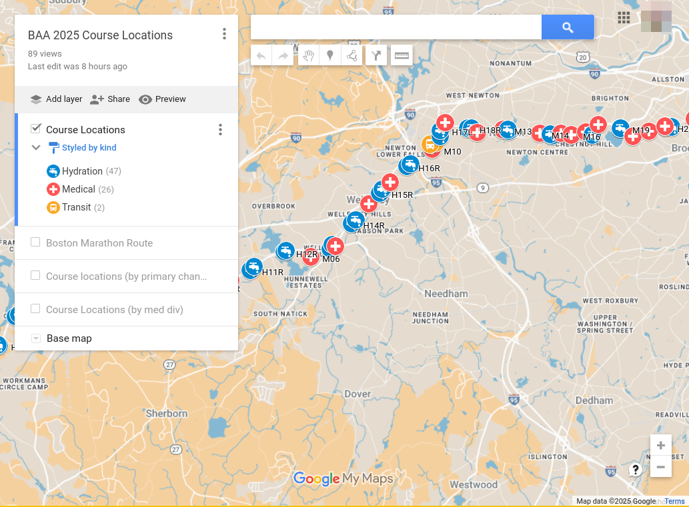

Source data used to produce [this google map of BAA amateur radio course locations][map].

The list of locations was extracted from the [2025 Course Station List] document.

[map]: https://www.google.com/maps/d/u/0/edit?mid=1Ljv1p6dRHARUxZPiSQDZWUojn-v0lwo&usp=sharing
[2025 course station list]: https://drive.google.com/file/d/1Ozprj3KAfSksGb4U0FuE_94XGygfFqJN/view?usp=sharing

## Prerequisites

1. You'll need a Google Maps API key. Place this in the `GOOGLE_MAPS_API_KEY` environment variable.

1. To produce GPX output, you need [gpsbabel].

1. You'll need the [uv] package manager. Install the requirements by running:

    ```
    uv sync
    ```

[uv]: https://github.com/astral-sh/uv
[gpsbabel]: https://www.gpsbabel.org

## Geocoding

To geocode the course locations, run:

```
uv run geocode.py course_locations_orig.csv -o course_locations_geocoded.csv
```

## Producing GPX and KML

To produce the GPX and KML versions of the data, run:

```
make
```

## The map

[][map]
